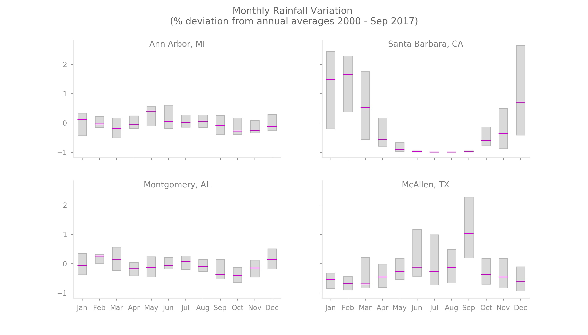

<a href="http://nbviewer.jupyter.org/github/reyvaz/Rainfall_Variation/blob/master/rainfall_variation.ipynb" target="_blank">Click Here</a>
to see the Notebook online in Jupyter nbviewer.

## Monthly Rainfall Variation (% deviation from annual averages 2000 - Sep 2017)

#### Analyzing rainfall variation, Python code and data files

This repository contains a Jupyter Notebook and supporting 
data files for analyzing rainfall variability. 

The data comes from the U.S. National Oceanic and 
Atmospheric Administration's (NOAA)  Daily Summaries. It was retrieved on
September 24, 2017 from [here](https://www.ncdc.noaa.gov/cdo-web/search?datasetid=GHCND), applying the following search parameters:  

* Date Range: 01-01-2000 - 09-30-2017  
* Locations (City): Ann Arbor, MI., Santa Barbara, CA., Montgomery, AL., McAllen, TX.  
* Data Set: Precipitation (all subsets).  

The data downloaded are available in this repository.   

#### Contents:

1. [rainfall_variation.ipynb](rainfall_variation.ipynb) Jupyter notebook that processes the data and creates the plot.
1. [ann_arbor.csv](ann_arbor.csv) contains rainfall and snowfall data from all stations in Ann Arbor MI., for the period reported.  
2. [santa_barbara.csv](santa_barbara.csv) contains rainfall and snowfall data for all stations in Santa Barbara CA., for the period reported.  
3. [montgomery.csv](montgomery.csv) contains rainfall and snowfall data for all stations in Montgomery AL., for the period reported. 
4. [mcallen.csv](mcallen.csv) contains rainfall and snowfall data for all stations in McAllen TX., for the period reported.  

 

 

 
